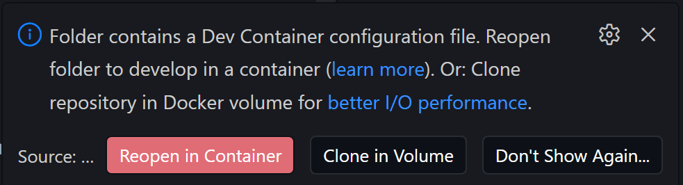

# MobiFlight Architecture

MobiFlight is a hybrid app:

- **C# backend** handles flight sim integration, hardware communication, and the execution engine
- **Frontend** provides the configuration UI. The frontend is a React + TypeScript app using Vite, Tailwind, and shadcn/ui. It runs inside a WebView2 control embedded in the C# backend window.
- Frontend and backend communicate through a JSON message bridge — the React side calls `PostMessage` and C# handles it via handlers in `BrowserMessages`.

The main backend subsystems are:

- **Execution engine** - reads variables from the flight simulator on a polling timer and applies user-defined mappings to drive output devices
- **Flight sim connectors** - separate integrations for MSFS (SimConnect), FSX/P3D (FSUIPC), and X-Plane
- **Hardware device drivers** - Arduino-based MobiFlight boards, Arcaze USB, MIDI boards, USB HID game controllers, and others
- **Browser message layer** - the IPC bridge between C# and the React UI

---

## Development Workflow

In development you run two things side by side:

- The frontend dev server works conveniently in [Visual Studio Code](https://code.visualstudio.com/), in the provided dev container
- The C# backend in [Visual Studio](https://visualstudio.microsoft.com/vs/community/). When you start the backend with the **Debug** build target it connects to the frontend dev server at `localhost:5173` and loads it automatically.

### Dev container setup

The easiest way to get started is with the included dev container — dependencies and Playwright browsers for unit tests are installed automatically on first startup.

1. [Follow the instructions](https://code.visualstudio.com/docs/devcontainers/tutorial) to install Docker and the Dev Containers extension in Visual Studio Code.
2. Select **Open Folder..** in VS Code, navigate to `src/MobiFlightConnector/frontend/`
3. When prompted by VSCode, select **Reopen in Container**



The first time takes a few minutes to configure while the necessary images are downloaded and dependencies install. After the container opens VSCode will prompt with a warning about an auto-configured task to run. Accept the task, and the frontend will start.

The frontend is served at `http://localhost:5173`.

To manually start the frontend, use the command palette (CTRL+SHIFT+P) to select the **Tasks: Run Task** command, then run **Start frontend**.

### Backend

The backend is a C# desktop application. and it must be running for full functionality. Once your devcontainer has finished starting up, and you see the localhost url in the devcontainer terminal output, proceed into Visual Studio.

Open `MobiFlightConnector.sln` and use the **Debug** build target to Run the project — this connects to the frontend dev server at `localhost:5173`.

## Translations (i18n)

Translation files are in `public/locales/{lang}/translation.json`. The app uses `react-i18next` — all user-facing strings must go through `t()`. Core languages that must be complete before a PR can be merged: `en`, `de`, `es`.

```sh
npm run check:i18n                       # run both checks below
npm run check:translations               # missing keys per language
npm run check:translations -- fi         # missing keys for a specific language
npm run check:hardcoded-strings          # components with hardcoded strings
npm run check:hardcoded-strings:verbose
```

## Testing

See [tests/README.md](tests/README.md).

## Legacy features

The old WinForms dialogs are legacy. All new UI work goes into the React frontend; the goal is to migrate everything over time. If you are adding a feature that touches the UI, build it in the frontend rather than WinForms. If unsure, discuss your ideas first on Discord #development channel.
